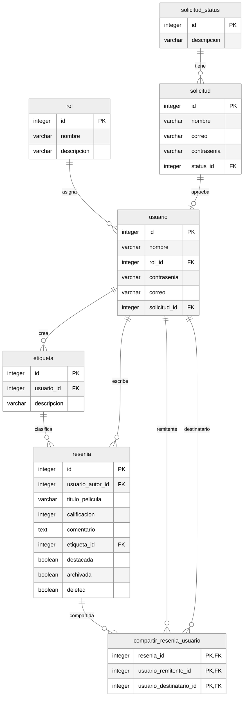
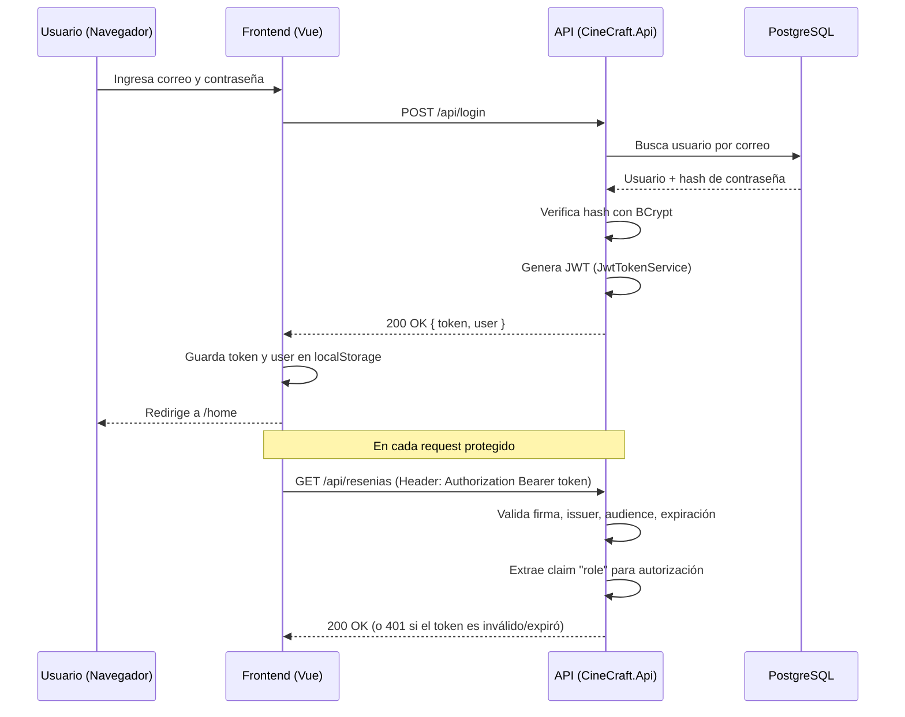

# Manual Tecnico

# Requerimientos de la Aplicación y Guía de Despliegue

## 1. Requisitos de Software

El proyecto **CineCraft** está compuesto por dos aplicaciones independientes (Backend y Frontend) más una base de datos relacional, orquestadas mediante Docker Compose. A continuación se detallan los requisitos según la modalidad de ejecución elegida.

### 1.1 Requisitos para ejecución vía Docker

| Software | Versión mínima | Uso |
|---|---|---|
| **Docker Engine** | 24.x o superior | Construcción y ejecución de contenedores |
| **Docker Compose** | v2.x (plugin `docker compose`) | Orquestación de los 3 servicios (`api`, `frontend`, `db`) |
| **Git** | Cualquier versión reciente | Clonar el repositorio |

> Con Docker no es necesario instalar .NET SDK ni Node.js en la máquina local, ya que ambos entornos de build se resuelven dentro de las imágenes multi-stage de cada `Dockerfile`.

### 1.2 Requisitos para ejecución nativa / desarrollo local

| Software | Versión mínima | Uso |
|---|---|---|
| **.NET SDK** | **10.0** | Compilar y ejecutar `CineCraft.Api` (ver `ARG DOTNET_VERSION=10.0` en `CineCraft/Dockerfile`) |
| **Node.js** | **24.x** (Alpine LTS, ver `ARG NODE_VERSION=24-alpine` en `frontend/Dockerfile`) | Compilar y ejecutar el frontend Vue |
| **npm** | Incluido con Node 24 | Gestor de paquetes del frontend |
| **PostgreSQL** | **15.x** (ver imagen `postgres:15-alpine` en `docker-compose.yaml`) | Base de datos relacional |
| **.NET Aspire Workload** (opcional) | Compatible con .NET 10 | Solo si se desea ejecutar el proyecto vía `CineCraft.AppHost` en modo Aspire, con dashboard de observabilidad y Postgres containerizado automáticamente |

### 1.3 Notas sobre versiones detectadas 

- El backend usa **imágenes "noble" (Ubuntu 24.04) chiseled/mínimas**: `mcr.microsoft.com/dotnet/sdk:10.0-noble` para build y `mcr.microsoft.com/dotnet/aspnet:10.0-noble` para runtime. Estas imágenes runtime no incluyen shell (`sh`), por lo que no se puede hacer `docker exec -it <contenedor> sh` sobre el contenedor de la API en producción.
- El frontend usa **Nginx Alpine** como servidor de archivos estáticos en producción, sirviendo el build de Vite (`/app/dist`) desde `/usr/share/nginx/html`.
- El backend expone su documentación OpenAPI/Swagger **únicamente en entorno `Development`** (ver `Program.cs`: `if (app.Environment.IsDevelopment()) { app.UseCineCraftSwaggerUI(); }`).

---

## 2. Servicios definidos en `docker-compose.yaml`

El archivo `docker-compose.yaml` en la raíz del repositorio define **3 servicios** conectados por una red interna (`app-network`, driver `bridge`):

###  Servicio `api`
- **Build context**: `./CineCraft`, usando `CineCraft/Dockerfile`.
- **Puerto expuesto**: `5000` (host) → `8080` (contenedor). El backend escucha internamente en `http://+:8080` (variable `ASPNETCORE_URLS`).
- **Dependencias**: `depends_on: db` (arranca después del contenedor de base de datos, aunque **no espera** a que Postgres esté realmente listo para aceptar conexiones — ver nota de troubleshooting más abajo).
- **Variables de entorno**: cargadas desde un archivo `.env` en la raíz del proyecto (`env_file: .env`), no incluido en el repositorio por seguridad.
- **Responsabilidad**: expone la API REST de CineCraft (autenticación JWT, gestión de reseñas, solicitudes, compartidos, reportes y usuarios) y ejecuta las migraciones de EF Core automáticamente al iniciar (`await app.MigrateDbAsync();` en `Program.cs`).

### Servicio `frontend`
- **Build context**: `./frontend`, usando `frontend/Dockerfile`.
- **Puerto expuesto**: `5173` (host) → `8080` (contenedor, servido por Nginx).
- **Dependencias**: `depends_on: api`.
- **Responsabilidad**: sirve la SPA de Vue 3 ya compilada (build estático de Vite) a través de Nginx, incluyendo el ruteo SPA (fallback a `index.html` para rutas manejadas por Vue Router).

### Servicio `db`
- **Imagen**: `postgres:15-alpine` (no se construye, se descarga de Docker Hub).
- **Puerto expuesto**: `5432` (host) → `5432` (contenedor) — accesible directamente desde el host para inspección con un cliente SQL.
- **Persistencia**: volumen nombrado `pgdata` montado en `/var/lib/postgresql/data`, para que los datos sobrevivan a reinicios/recreación de contenedores.
- **`restart: always`**: se reinicia automáticamente si el proceso de Postgres falla.
- **Variables de entorno**: también cargadas desde `.env` (usuario, contraseña y nombre de la base, consumidos internamente por la imagen oficial de Postgres para inicializar el clúster).

### Red y volúmenes
- **Red `app-network`** (driver `bridge`): permite que `api`, `frontend` y `db` se resuelvan entre sí por nombre de servicio (ej. el backend se conecta a la base como `db:5432`, no como `localhost`).
- **Volumen `pgdata`**: único volumen declarado, exclusivo para la persistencia de PostgreSQL.

---

## 3. Guía de Despliegue Paso a Paso 

### Paso 1 — Clonar el repositorio

```bash
git clone https://github.com/Sebastian-G-0607/AYD1-Practica2S2026_A_G7.git 
cd AYD1-Practica2S2026_A_G7
```

### Paso 2 — Crear el archivo de variables de entorno `.env`

En la raíz del proyecto (mismo nivel que `docker-compose.yaml`), crear un archivo `.env` con, como mínimo, las siguientes variables (los nombres exactos que consume el backend están definidos en `DatabaseOptions.cs`, `AuthOptions.cs` y `UsersOptions.cs`):

```env
# --- Base de datos (consumidas por el contenedor 'db' y por 'api') ---
POSTGRES_USER=cinecraft_user
POSTGRES_PASSWORD=cambia_esta_password
POSTGRES_DB=cinecraft

# --- Sección "Database" en appsettings.json (backend) ---
Database__DB_USER=cinecraft_user
Database__DB_PASSWORD=cambia_esta_password
Database__DB_HOST=db
Database__DB_PORT=5432
Database__DB_NAME=cinecraft

# --- Sección "Auth" (JWT) ---
Auth__SecretKey=una_clave_secreta_larga_y_aleatoria
Auth__Issuer=CineCraft.Api
Auth__Audience=CineCraft.Client
Auth__ExpirationMinutes=60

# --- Usuario administrador sembrado automáticamente al primer arranque ---
Users__DefaultAdminEmail=admin@cinecraft.com
Users__DefaultAdminPassword=CambiaEstaPassword123!

# --- SMTP (envío de correos de aprobación/rechazo de solicitudes) ---
Smtp__Host=smtp.mailtrap.io
Smtp__Port=587
Smtp__Username=tu_usuario_smtp
Smtp__Password=tu_password_smtp

# --- Frontend (Vite) ---
VITE_API_BASE_URL=http://localhost:5000
VITE_APP_ENV=local
```

> ⚠️ **Importante**: `appsettings.json` trae estos valores vacíos por diseño (`"SecretKey": ""`, `"DB_HOST": ""`, etc.). La aplicación **no arrancará** sin un `Auth__SecretKey` válido, ya que `AuthOptions` se valida con `.ValidateDataAnnotations().ValidateOnStart()` en `Program.cs`.

### Paso 3 — Levantar todo el stack con Docker Compose

Desde la raíz del proyecto:

```bash
docker compose up --build
```

Esto:
1. Construye la imagen del backend (`api`) en dos etapas: restore/publish con el SDK de .NET 10, y runtime con ASP.NET 10.
2. Construye la imagen del frontend (`frontend`): `npm install --legacy-peer-deps` → `npm run build` → copia del `dist/` a un contenedor Nginx.
3. Descarga la imagen `postgres:15-alpine` para el servicio `db`.
4. Levanta los tres contenedores en la red `app-network`.

Para ejecutarlo en segundo plano:

```bash
docker compose up --build -d
```

### Paso 4 — Verificar que los servicios están arriba

```bash
docker compose ps
```

Deberías ver los 3 servicios en estado `Up`/`running`.

### Paso 5 — Confirmar la inicialización de la base de datos

Al arrancar, el backend ejecuta automáticamente:
- `dbContext.Database.MigrateAsync()` → aplica todas las migraciones pendientes (crea el esquema completo).
- Un **seeding automático** (`UseSeeding`/`UseAsyncSeeding` en `DataExtensions.cs`) que, si las tablas están vacías, inserta:
  - Los 3 estados de solicitud: `Pendiente`, `Aprobado`, `Rechazado`.
  - Los 2 roles del sistema: `admin`, `estandar`.
  - Un **usuario administrador** por defecto, usando `Users__DefaultAdminEmail` / `Users__DefaultAdminPassword` del `.env`, con la contraseña hasheada con BCrypt.

Puedes revisar los logs para confirmarlo:

```bash
docker compose logs -f api
```

### Paso 6 — Acceder a la aplicación

| Recurso | URL |
|---|---|
| Frontend (SPA) | http://localhost:5173 |
| API Backend | http://localhost:5000 |
| PostgreSQL (cliente externo, ej. DBeaver/pgAdmin) | `localhost:5432` |

Inicia sesión con el correo/contraseña definidos en `Users__DefaultAdminEmail` / `Users__DefaultAdminPassword` para acceder como **administrador**.

### Paso 7 — Detener y limpiar el entorno

```bash
# Detener los contenedores (conserva el volumen de datos)
docker compose down

# Detener y eliminar también el volumen de la base de datos (borra todos los datos)
docker compose down -v
```

---

## 4. Ejecución alternativa sin Docker (modo desarrollo)

Útil para depuración activa del código.

### 4.1 Base de datos
Levantar solo el contenedor de Postgres (o una instancia local instalada):
```bash
docker compose up db -d
```

### 4.2 Backend
```bash
cd CineCraft/src/CineCraft.Api
dotnet restore
dotnet run
```
El backend leerá variables desde un archivo `.env` en la raíz del repo gracias a `DotNetEnv.Env.TraversePath().Load();` (solo activo en `Development`, ver `Program.cs`). Por defecto escuchará en `http://localhost:5082` y `https://localhost:7077` (ver `launchSettings.json`).

### 4.3 Frontend
```bash
cd frontend
npm install --legacy-peer-deps
npm run dev
```
Asegúrate de definir `VITE_API_BASE_URL` apuntando al backend local (ej. `http://localhost:5082`) en un archivo `.env` o `.env.local` dentro de `frontend/`.

### 4.4 Alternativa con .NET Aspire (orquestación avanzada)
El proyecto incluye `CineCraft.AppHost`, que permite levantar API + PostgreSQL (containerizado automáticamente, con pgAdmin en el puerto `5050`) desde un único comando, con dashboard de observabilidad incluido:
```bash
cd CineCraft/src/CineCraft.AppHost
dotnet run
```
El dashboard de Aspire se expone según las variables `ASPIRE_DASHBOARD_OTLP_ENDPOINT_URL` (`http://localhost:19002`) definidas en su `launchSettings.json`, y la API queda expuesta en el puerto `5000` con un enlace directo a `/swagger`.

---

## 5. Troubleshooting común

- **La API falla al arrancar con error de conexión a la base de datos**: `docker-compose.yaml` usa `depends_on: db` sin `condition: service_healthy`, es decir, Docker solo espera a que el contenedor de Postgres *arranque*, no a que esté *listo para aceptar conexiones*. Si ocurre en el primer `up`, reinicia solo la API: `docker compose restart api`.
- **Error `Auth:SecretKey` inválido al iniciar**: revisa que `Auth__SecretKey` esté definido en `.env` y no vacío; `AuthOptions` usa `ValidateOnStart()`.
- **El frontend no logra llamar a la API (CORS o 404)**: confirma que `VITE_API_BASE_URL` apunte al puerto correcto (`5000` con Docker, o el puerto local de `dotnet run`).

# Descripción de los Métodos Utilizados y Arquitectura

## 1. Patrón arquitectónico general

**CineCraft.Api** no sigue el patrón MVC/Controllers tradicional de ASP.NET. Utiliza **Minimal APIs** organizadas bajo el patrón **Vertical Slice Architecture** (Feature Folders): cada funcionalidad de negocio vive en su propia carpeta bajo `Features/`, con sus propios archivos `*Endpoint.cs` (lógica del endpoint), `*Dtos.cs` (contratos de entrada/salida) y un `*Endpoints.cs` por módulo que agrupa y registra las rutas (`MapGroup`) en `Program.cs`.

El frontend **Vue 3 + TypeScript** sigue una arquitectura por capas dentro de `src/`: `views` (páginas enrutadas) → `components/features` (lógica de UI por dominio) → `composables`/`stores` (estado y lógica reactiva) → `services` (llamadas HTTP vía Axios) → `types` (contratos TS compartidos).

---

## 2. Backend — Módulos, Endpoints y responsabilidades

### `Features/Auth` — Autenticación
- **`AuthEndpoints.cs`**: agrupa las rutas bajo el prefijo `/api`.
- **`LoginEndpoint.cs`** → `POST /api/login`: valida credenciales del `Usuario` contra la contraseña hasheada (BCrypt), genera un **JWT** mediante `JwtTokenService` y devuelve token + datos del usuario (rol, expiración). Es el único punto de entrada de autenticación del sistema; no requiere autorización previa.

###  `Features/Solicitudes` — Registro público por aprobación
- **`SolicitudesEndpoints.cs`**: agrupa rutas bajo `/api/solicitudes`.
- **`CrearSolicitudEndpoint.cs`** → `POST /api/solicitudes`: permite a un visitante no autenticado crear una `Solicitud` de registro (nombre, correo, contraseña), la cual queda en estado `Pendiente` hasta revisión de un administrador. Resuelve el flujo de "alta controlada" de usuarios, evitando registro libre.

### `Features/Admin/Solicitudes` — Revisión administrativa de solicitudes
- **`AdminSolicitudesEndpoints.cs`**: agrupa rutas bajo `/api`, protegidas con la política **`AdminOnly`**.
- **`GetPendientesEndpoint.cs`** → `GET /admin/solicitudes/pendientes`: lista las solicitudes con estado `Pendiente`, ordenadas por fecha descendente.
- **`GetHistorialEndpoint.cs`** → `GET /admin/solicitudes/historial`: lista las solicitudes ya resueltas (estado distinto de `Pendiente`), es decir, el histórico de aprobaciones/rechazos.
- **`ProcesarSolicitudEndpoint.cs`** → `POST /admin/solicitudes/procesar`: recibe `solicitud_id`, `aprobar` (bool) y opcionalmente `motivo_rechazo`. Si se aprueba, crea el `Usuario` real vinculado a la solicitud, le asigna el rol `estandar` y dispara un correo de notificación (`IEmailService.SendApprovalEmail`); si se rechaza, actualiza el estado y notifica el motivo (`SendRejectionEmail`). Es el corazón del flujo de moderación de altas.

### `Features/Resenias` — Gestión de reseñas de películas
- **`ReseniasEndpoints.cs`**: agrupa rutas bajo `/api/resenias`.
- **`GetReseniasEndpoint.cs`** → `GET /api/resenias`: devuelve las reseñas activas (no eliminadas) del usuario autenticado.
- **`GetReseniasArchivadasEndpoint.cs`** → `GET /api/resenias/archivadas`: devuelve solo las reseñas marcadas como `Archivada = true`.
- **`CreateReseniaEndpoint.cs`** → `POST /api/resenias`: crea una nueva reseña (título de película, calificación, comentario y etiqueta —existente o nueva—). Resuelve la funcionalidad central de la app: registrar la opinión de un usuario sobre una película.
- **`UpdateReseniaEndpoint.cs`** → `PUT /api/resenias/{id}`: edita una reseña existente, validando que pertenezca al usuario autor.
- **`DeleteReseniaEndpoint.cs`** → `DELETE /api/resenias/{id}`: realiza **soft delete** (marca `Deleted = true` en lugar de borrar el registro físico), preservando el historial e integridad referencial con `compartir_resenia_usuario`.
- **`ToggleDestacarEndpoint.cs`** → `PATCH /api/resenias/{id}/destacar`: alterna el flag `Destacada`, usado para resaltar reseñas en la vista pública de "Destacadas".
- **`ToggleArchivarEndpoint.cs`** → `PATCH /api/resenias/{id}/archivar`: alterna el flag `Archivada`, permitiendo ocultar reseñas de la vista principal sin eliminarlas.

### `Features/Shares` — Compartir reseñas entre usuarios
- **`SharesEndpoints.cs`**: agrupa rutas bajo `/api/shares`.
- **`ShareReviewEndpoint.cs`** → `POST /api/shares` (individual) y `POST /api/shares/batch` (múltiple): registra en `compartir_resenia_usuario` que un usuario remitente comparte una reseña con uno o varios usuarios destinatarios.
- **`GetMySharesEndpoint.cs`** → `GET /api/shares/my-shares` y `GET /api/shares/my-shares/{remitenteId}`: lista las reseñas que el usuario autenticado (o uno específico) ha compartido con otros.
- **`GetSharedWithMeEndpoint.cs`** → `GET /api/shares/shared-with-me` y `GET /api/shares/shared-with-me/{destinatarioId}`: lista las reseñas que otros usuarios han compartido con el usuario autenticado.
- **`UnshareReviewEndpoint.cs`** → `DELETE /api/shares/{reseniaId}/{destinatarioId}`: elimina un registro de compartido específico, revocando el acceso de ese destinatario a la reseña.

### `Features/Reportes` — Reportería administrativa
- **`ReportesEndpoints.cs`**: agrupa rutas bajo `/reportes`, protegidas con `AdminOnly`.
- **`GetTopUsuariosReseniasEndpoint.cs`** → `GET /reportes/top-resenias`: retorna el ranking de usuarios con más reseñas creadas.
- **`GetTopUsuariosCompartidosEndpoint.cs`** → `GET /reportes/top-compartidos`: retorna el ranking de usuarios que más reseñas han compartido. Ambos endpoints resuelven los reportes gerenciales de actividad de la plataforma para el panel de administración.

### `Features/Users` — Gestión de perfil y usuarios
- **`UsersEndpoints.cs`**: agrupa rutas bajo `/api/users`.
- **`GetProfileEndpoint.cs`** → `GET /api/users/profile`, `GET /api/users/profile/{id}`, `GET /api/users/{id}`: obtiene los datos de perfil de un usuario (nombre, correo, rol, totales de reseñas/compartidos).
- **`UpdateProfileEndpoint.cs`** → `PUT /api/users/actualizar/{id}` y `PUT /api/users/{id}`: actualiza nombre/correo y, opcionalmente, cambia la contraseña validando la actual.
- **`GetUsersEndpoint.cs`** → `GET /api/users`: lista todos los usuarios registrados (uso administrativo, ej. para seleccionar destinatarios al compartir).

### Componentes transversales (`Shared/`)
- **`JwtTokenService`** (`Shared/Authentication`): genera y firma los JWT emitidos en el login, usando la configuración de `AuthOptions` (`SecretKey`, `Issuer`, `Audience`, `ExpirationMinutes`).
- **`JwtBearerOptionsSetup`**: configura los parámetros de validación del middleware de autenticación JWT Bearer de ASP.NET.
- **`GlobalExceptionHandler`** (`Shared/ErrorHandling`): captura cualquier excepción no controlada, la registra en logs (con `TraceId`) y responde con un `ProblemDetails` genérico (HTTP 500), evitando exponer detalles internos.
- **`CorsExtensions`**: configura la política CORS que permite al frontend (origen distinto) consumir la API.
- **`OpenApiExtensions`**: agrega el esquema de seguridad Bearer a la documentación OpenAPI/Swagger, generada solo en desarrollo.
- **`SmtpEmailService`** (implementa `IEmailService`): envía los correos de aprobación/rechazo de solicitudes de registro vía SMTP (MailKit).
- **`DataExtensions.MigrateDbAsync`**: aplica migraciones de EF Core automáticamente al iniciar la aplicación (`Program.cs`), evitando pasos manuales de migración en despliegue.

---

## 3. Frontend — Vistas, componentes y estado clave

### Enrutamiento (`router/index.ts`)
Define rutas protegidas por autenticación y por rol (`estandar` / `admin`) mediante un guard global (`router.beforeEach`) que consulta `useAuthStore`. Redirige automáticamente según el rol tras login, y bloquea el acceso cruzado entre secciones de admin y estándar.

### Autenticación y estado global
- **`stores/auth.store.ts`** (Pinia): store central de sesión. Persiste `token` y `user` en `localStorage`, expone `isAuthenticated` (valida expiración del token), `isAdmin`/`isEstandar` (deriva el rol) y las acciones `login()`/`logout()`. Es la fuente de verdad de sesión consumida por el router y por los componentes de UI.
- **`stores/admin.store.ts`** (Pinia): estado específico del panel administrativo (solicitudes, reportes).
- **`services/http.client.ts`**: instancia central de **Axios**, con interceptor de request que inyecta automáticamente el header `Authorization: Bearer <token>` desde `localStorage`, y un interceptor de response que centraliza el logging de errores HTTP.
- **`composables/useAuth.ts`**: lógica reutilizable de autenticación consumida por los formularios de login.
- **`composables/useRegister.ts`**: lógica del formulario de solicitud de registro.

### Componentes de negocio (`components/features/`)
- **`LoginForm.vue`** / **`RegisterForm.vue`**: formularios de inicio de sesión y de solicitud de alta, respectivamente; consumen `auth.service.ts` y `solicitud.service.ts`.
- **`resenias/ReseniaForm.vue`**: formulario modal para crear/editar una reseña (título, calificación, comentario, etiqueta).
- **`resenias/ReseniasList.vue`**: listado principal de reseñas del usuario autenticado, con acciones de archivar/destacar/eliminar/compartir.
- **`resenias/ReseniasArchivadas.vue`**: vista de solo-lectura/gestión de reseñas archivadas.
- **`resenias/ReseniasDestacadas.vue`**: sección de reseñas marcadas como destacadas (vista tipo "carrusel" en el Home).
- **`shares/MySharesList.vue`**: listado de reseñas que el usuario ha compartido con otros.
- **`shares/SharedWithMeList.vue`**: listado de reseñas que otros han compartido con el usuario.
- **`shares/ShareReviewModal.vue`**: modal para seleccionar destinatario(s) y compartir una reseña puntual.
- **`profile/UserProfile.vue`**: pantalla de edición de perfil (datos personales y cambio de contraseña).
- **`reports/AdminReports.vue`**: dashboard administrativo que consume `reportes.service.ts` (top usuarios por reseñas y por compartidos).
- **`layout/Header.vue`** / **`layout/Sidebar.vue`**: navegación persistente, con opciones condicionadas al rol del usuario autenticado.

### Layouts
- **`AuthLayout.vue`**: layout minimalista para pantallas públicas (Login, Registro).
- **`MainLayout.vue`**: layout con `Header` + `Sidebar` para todas las vistas autenticadas.

### Capa de servicios (`services/`)
Cada archivo `*.service.ts` encapsula las llamadas HTTP de un dominio específico usando `httpClient` (Axios): `auth.service.ts`, `resenia.service.ts`, `shares.service.ts`, `solicitud.service.ts`, `admin.service.ts`, `profile.service.ts`, `reportes.service.ts`. Esta separación evita que los componentes Vue conozcan detalles de la API REST directamente (URLs, verbos HTTP), delegando esa responsabilidad a la capa de servicios.

# Diseño de la Base de Datos (ERD)

CineCraft utiliza **PostgreSQL 15** como motor relacional, con el esquema gestionado íntegramente por **migraciones de Entity Framework Core** (`CineCraft.Api/Data/Migrations/`). A continuación se documenta cada tabla según el diagrama entidad-relación oficial del proyecto y su implementación real en el código (`Data/Configurations/*EntityConfiguration.cs` y migraciones).

## Diagrama Entidad-Relación



---

## Detalle de tablas

### `rol`
Catálogo de roles del sistema.

| Campo | Tipo (PostgreSQL) | Restricciones |
|---|---|---|
| `id` | `integer` | PK, identidad autogenerada |
| `nombre` | `character varying(100)` | `NOT NULL` |
| `descripcion` | `character varying(255)` | Nullable |

**Regla de negocio**: la tabla se siembra automáticamente al primer arranque de la API con exactamente dos valores fijos: `admin` y `estandar` (`DataExtensions.SeedRoles`). No existe endpoint para crear roles adicionales desde la aplicación; es un catálogo cerrado.

---

###  `solicitud_status`
Catálogo de estados posibles de una solicitud de registro.

| Campo | Tipo (PostgreSQL) | Restricciones |
|---|---|---|
| `id` | `integer` | PK, identidad autogenerada |
| `descripcion` | `character varying(255)` | `NOT NULL` |

**Regla de negocio**: sembrada automáticamente con tres valores fijos: `Pendiente`, `Aprobado`, `Rechazado` (`DataExtensions.SeedSolicitudStatuses`). El flujo de moderación de altas depende enteramente de este catálogo.

---

###  `solicitud`
Representa una petición de registro hecha por un visitante no autenticado, pendiente de aprobación por un administrador.

| Campo | Tipo (PostgreSQL) | Restricciones |
|---|---|---|
| `id` | `integer` | PK, identidad autogenerada |
| `nombre` | `character varying(150)` | `NOT NULL` |
| `correo` | `character varying(150)` | `NOT NULL` |
| `contrasenia` | `character varying(255)` | `NOT NULL` (hash BCrypt) |
| `status_id` | `integer` | FK → `solicitud_status.id`, `NOT NULL`, `ON DELETE RESTRICT` |
| `fecha_solicitud` | `timestamp with time zone` | `NOT NULL` (agregado en migración `ValidacionesRegistro`) |
| `motivo_rechazo` | `character varying(255)` | Nullable — se completa solo si la solicitud es rechazada |

**Índice**: `IX_solicitud_status_id` sobre `status_id`.

**Regla de negocio**: creada por `POST /api/solicitudes` (endpoint público). Un administrador la revisa mediante `POST /admin/solicitudes/procesar`; si la aprueba, se genera el registro correspondiente en `usuario` vinculado a esta solicitud, y si la rechaza, se completa `motivo_rechazo` y el `status_id` cambia a "Rechazado". La contraseña ya llega hasheada desde el momento de la solicitud, de modo que al aprobarse se reutiliza directamente en el nuevo `usuario`.

---

###  `usuario`
Representa una cuenta real y activa dentro del sistema, con capacidad de iniciar sesión.

| Campo | Tipo (PostgreSQL) | Restricciones |
|---|---|---|
| `id` | `integer` | PK, identidad autogenerada |
| `nombre` | `character varying(150)` | `NOT NULL` |
| `rol_id` | `integer` | FK → `rol.id`, `NOT NULL`, `ON DELETE RESTRICT` |
| `contrasenia` | `character varying(255)` | `NOT NULL` (hash BCrypt) |
| `correo` | `character varying(150)` | `NOT NULL`, **`UNIQUE`** (índice `IX_usuario_correo`, agregado en `ValidacionesRegistro`) |
| `solicitud_id` | `integer` | FK → `solicitud.id`, Nullable, **`UNIQUE` parcial** (índice `IX_usuario_solicitud_id`, filtro `WHERE solicitud_id IS NOT NULL`), `ON DELETE RESTRICT` |

**Índices**: `IX_usuario_rol_id`, `IX_usuario_correo` (único), `IX_usuario_solicitud_id` (único filtrado).

**Regla de negocio**:
- El `correo` es único a nivel de base de datos, garantizando que no existan cuentas duplicadas y habilitando el login por correo.
- La relación `solicitud ||--o| usuario` (uno a uno opcional) refleja que **todo usuario estándar proviene de una solicitud aprobada**, mientras que el **usuario administrador semilla** (`DataExtensions.SeedUsuarioAdmin`) se crea directamente con `SolicitudId = null`, ya que no pasa por el flujo de aprobación.
- `ON DELETE RESTRICT` en ambas FKs (`rol_id`, `solicitud_id`) impide borrar un rol o una solicitud si existen usuarios que dependen de ellos, preservando la integridad histórica.

---

###  `etiqueta`
Etiquetas (categorías/tags) creadas por un usuario para clasificar sus reseñas.

| Campo | Tipo (PostgreSQL) | Restricciones |
|---|---|---|
| `id` | `integer` | PK, identidad autogenerada |
| `usuario_id` | `integer` | FK → `usuario.id`, `NOT NULL`, `ON DELETE RESTRICT` |
| `descripcion` | `character varying(255)` | `NOT NULL` |

**Índice**: `IX_etiqueta_usuario_id`.

**Regla de negocio**: cada etiqueta pertenece a un único usuario (no son globales/compartidas entre usuarios). Al crear una reseña (`CreateReseniaEndpoint`), el usuario puede reutilizar una etiqueta existente (`EtiquetaId`) o crear una nueva sobre la marcha (`NuevaEtiqueta`), evidenciando que el modelo de etiquetas es personal por diseño, no un catálogo global.

---

###  `resenia`
Entidad central del sistema: la opinión de un usuario sobre una película.

| Campo | Tipo (PostgreSQL) | Restricciones |
|---|---|---|
| `id` | `integer` | PK, identidad autogenerada |
| `usuario_autor_id` | `integer` | FK → `usuario.id`, `NOT NULL`, `ON DELETE RESTRICT` |
| `titulo_pelicula` | `character varying(255)` | `NOT NULL` |
| `calificacion` | `integer` | `NOT NULL`, `CHECK (calificacion >= 1 AND calificacion <= 5)` |
| `comentario` | `text` | Nullable |
| `etiqueta_id` | `integer` | FK → `etiqueta.id`, `NOT NULL`, `ON DELETE RESTRICT` |
| `destacada` | `boolean` | `NOT NULL`, `DEFAULT false` |
| `archivada` | `boolean` | `NOT NULL`, `DEFAULT false` |
| `deleted` | `boolean` | `NOT NULL`, `DEFAULT false` |

**Índices**: `IX_resenia_etiqueta_id`, `IX_resenia_usuario_autor_id`.

**Constraint destacable**: la restricción `CK_resenia_calificacion` **cambió de rango** entre migraciones — originalmente permitía `0–10` (`InitialCreate`) y fue endurecida a `1–5` en la migración `ValidacionesRegistro`, coincidiendo con lo declarado en `ReseniaEntityConfiguration.cs`. El sistema actual, por tanto, solo acepta calificaciones de 1 a 5 estrellas.

**Regla de negocio**:
- `deleted` implementa **soft delete**: al "eliminar" una reseña (`DeleteReseniaEndpoint`) el registro no se borra físicamente, sino que se marca `deleted = true`, preservando la integridad con `compartir_resenia_usuario` (que podría referenciar esa reseña) y el historial de reportes.
- `destacada` y `archivada` son flags independientes que alimentan las vistas "Destacadas" y "Archivadas" del frontend, sin necesidad de tablas adicionales.
- `ON DELETE RESTRICT` en `etiqueta_id` y `usuario_autor_id` impide eliminar una etiqueta o un usuario si tienen reseñas asociadas.

---

###  `compartir_resenia_usuario`
Tabla intermedia (muchos-a-muchos) que registra el compartir de una reseña de un usuario remitente a un usuario destinatario.

| Campo | Tipo (PostgreSQL) | Restricciones |
|---|---|---|
| `resenia_id` | `integer` | **PK compuesta** (1/3), FK → `resenia.id`, `ON DELETE RESTRICT` |
| `usuario_remitente_id` | `integer` | **PK compuesta** (2/3), FK → `usuario.id`, `ON DELETE RESTRICT` |
| `usuario_destinatario_id` | `integer` | **PK compuesta** (3/3), FK → `usuario.id`, `ON DELETE RESTRICT` |

**Clave primaria compuesta**: `(resenia_id, usuario_remitente_id, usuario_destinatario_id)` — garantiza a nivel de base de datos que **no puedan existir registros duplicados** de "el mismo remitente comparte la misma reseña con el mismo destinatario dos veces".

**Índices**: `IX_compartir_resenia_usuario_usuario_destinatario_id`, `IX_compartir_resenia_usuario_usuario_remitente_id` (soportan las consultas de `GetMySharesEndpoint` y `GetSharedWithMeEndpoint`, que filtran por remitente o destinatario respectivamente).

**Regla de negocio**: modela dos relaciones distintas hacia `usuario` desde la **misma tabla** (remitente y destinatario), lo que en el código C# se traduce en dos propiedades de navegación independientes en `Usuario.cs` (`ReseniasEnviadas` y `ReseniasRecibidas`) y en dos `HasOne(...).WithMany(...)` separados en `CompartirReseniaUsuarioEntityConfiguration.cs`. El endpoint `UnshareReviewEndpoint` (`DELETE /api/shares/{reseniaId}/{destinatarioId}`) revoca un compartido específico eliminando la fila correspondiente.

---

## Resumen de relaciones de negocio

| Relación | Cardinalidad | Explicación de negocio |
|---|---|---|
| `solicitud_status` → `solicitud` | 1 a N | Un estado agrupa muchas solicitudes; toda solicitud tiene exactamente un estado vigente. |
| `rol` → `usuario` | 1 a N | Un rol (`admin`/`estandar`) puede estar asignado a muchos usuarios; todo usuario tiene exactamente un rol. |
| `solicitud` → `usuario` | 1 a 0..1 (opcional) | Una solicitud aprobada da origen, como máximo, a un único usuario (unicidad garantizada por índice filtrado). El admin semilla no tiene solicitud asociada. |
| `usuario` → `etiqueta` | 1 a N | Un usuario puede crear múltiples etiquetas propias para clasificar sus reseñas. |
| `etiqueta` → `resenia` | 1 a N | Una etiqueta puede usarse en varias reseñas del mismo usuario. |
| `usuario` → `resenia` | 1 a N | Un usuario (autor) puede escribir múltiples reseñas. |
| `resenia` → `compartir_resenia_usuario` | 1 a N | Una misma reseña puede compartirse con múltiples destinatarios distintos. |
| `usuario` → `compartir_resenia_usuario` (remitente) | 1 a N | Un usuario puede compartir múltiples reseñas (como remitente). |
| `usuario` → `compartir_resenia_usuario` (destinatario) | 1 a N | Un usuario puede recibir múltiples reseñas compartidas (como destinatario). |


---


# Modelo de Seguridad y Autenticación (JWT y Roles)

## 1. Resumen del mecanismo

CineCraft utiliza **JSON Web Tokens (JWT)** con firma simétrica **HMAC-SHA256** como único mecanismo de autenticación. No existen cookies de sesión ni autenticación basada en servidor con estado (*stateless*): cada solicitud protegida debe incluir el token en el header `Authorization`.

La autorización por **roles** (`admin` / `estandar`) se resuelve leyendo un claim `role` embebido directamente en el token, sin consultar la base de datos en cada request.

## 2. Ciclo de vida del token

### 2.1 Emisión (Login)

1. El usuario envía `correo` y `contrasenia` a `POST /api/login`.
2. El endpoint valida la contraseña contra el hash almacenado (BCrypt).
3. Si es válida, `JwtTokenService.GenerateToken()` construye el token con estos **claims**:

```csharp
var claims = new[]
{
    new Claim(JwtRegisteredClaimNames.Sub, usuario.Id.ToString()),
    new Claim(JwtRegisteredClaimNames.Email, usuario.Correo),
    new Claim("nombre", usuario.Nombre),
    new Claim("role", rolNombre),
    new Claim(JwtRegisteredClaimNames.Jti, Guid.NewGuid().ToString())
};

var token = new JwtSecurityToken(
    issuer: opts.Issuer,
    audience: opts.Audience,
    claims: claims,
    expires: DateTime.UtcNow.AddMinutes(opts.ExpirationMinutes),
    signingCredentials: credentials
);
```

4. El backend responde con el token firmado + los datos del usuario.

### 2.2 Almacenamiento en el cliente

El frontend (Pinia, `stores/auth.store.ts`) guarda el `token` y el objeto `user` en **`localStorage`** del navegador. Esto significa:
- La sesión persiste entre recargas de página y cierres del navegador (hasta que el token expire o se cierre sesión manualmente).
- El token **no** se guarda en una cookie `httpOnly`, por lo que es responsabilidad del frontend evitar exponerlo (ej. no interpolarlo en el DOM sin escapar, cuidado con XSS).

### 2.3 Envío en cada solicitud

`services/http.client.ts` define un **interceptor de request de Axios** que agrega automáticamente el header en cada llamada saliente:

Authorization: Bearer <token>

Este header se lee directamente de `localStorage` en cada request, no se mantiene en memoria de forma separada.

### 2.4 Validación en el backend

`JwtBearerOptionsSetup.cs` configura los parámetros de validación que ASP.NET aplica automáticamente a cada request entrante con el middleware `UseAuthentication()`:

```csharp
options.TokenValidationParameters = new TokenValidationParameters
{
    ValidateIssuer = true,
    ValidIssuer = opts.Issuer,
    ValidateAudience = true,
    ValidAudience = opts.Audience,
    ValidateIssuerSigningKey = true,
    IssuerSigningKey = key,
    ValidateLifetime = true,
    ClockSkew = TimeSpan.Zero,
    RoleClaimType = "role"
};
options.MapInboundClaims = false;
```

Puntos clave de esta configuración:
- **`ValidateLifetime = true` + `ClockSkew = TimeSpan.Zero`**: el token se rechaza exactamente en el segundo en que expira, sin margen de tolerancia adicional (otros sistemas suelen dar 5 minutos de gracia; aquí no).
- **`RoleClaimType = "role"`**: le indica a ASP.NET que el claim `"role"` (no el URI largo por defecto de `.NET Identity`) es el que debe usarse para resolver `[Authorize(Roles = ...)]` y las políticas basadas en rol.
- **`MapInboundClaims = false`**: evita que ASP.NET remapee automáticamente los nombres cortos de claims (`sub`, `email`) a URIs largos de Microsoft, manteniendo el token limpio y legible.

### 2.5 Expiración y cierre de sesión

- El token expira a los **`ExpirationMinutes`** minutos configurados (por defecto **60**, ver `AuthOptions.cs`).
- CineCraft **no implementa refresh tokens**: cuando el token expira, cualquier request protegido devuelve `401 Unauthorized`, y el usuario debe volver a iniciar sesión manualmente.
- El **logout** (`authStore.logout()`) es una operación puramente del lado del cliente: borra `token` y `user` de `localStorage` y redirige a `/login`. El backend no mantiene una lista de tokens revocados/invalidados — un token robado sigue siendo válido hasta que expira por tiempo, aunque el usuario "cierre sesión".

## 3. Roles y política de autorización

El sistema define exactamente **dos roles** (tabla `rol`, sembrada al arranque): `admin` y `estandar`.

La única política de autorización registrada en `Program.cs` es:

```csharp
builder.Services.AddAuthorizationBuilder()
    .AddPolicy("AdminOnly", policy => policy.RequireRole("admin"));
```

Esta política se aplica de forma explícita en cada grupo/endpoint que la requiere, con `.RequireAuthorization("AdminOnly")`.

## 4. Matriz de acceso por endpoint

| Endpoint | Método | Nivel de acceso |
|---|---|---|
| `/api/login` | POST | Público |
| `/api/solicitudes` | POST | Público |
| `/admin/solicitudes/pendientes` | GET |  `AdminOnly` |
| `/admin/solicitudes/historial` | GET |  `AdminOnly` |
| `/admin/solicitudes/procesar` | POST |  `AdminOnly` |
| `/reportes/top-resenias` | GET |  `AdminOnly` |
| `/reportes/top-compartidos` | GET |  `AdminOnly` |
| `/api/resenias` (todos los verbos) | GET/POST/PUT/DELETE | Autenticado (cualquier rol) |
| `/api/resenias/{id}/destacar` \| `/archivar` | PATCH |  Autenticado |
| `/api/shares/*` | GET/POST/DELETE | Autenticado |
| `/api/users/*` | GET/PUT |  Autenticado |


## 5. Configuración de CORS asociada

Complementa el modelo de seguridad: `CorsExtensions.cs` define una política **distinta según el ambiente**:

```csharp
if (builder.Environment.IsDevelopment())
{
    policy.AllowAnyOrigin();
}
else
{
    var originsString = builder.Configuration["AllowedOrigins"] ?? string.Empty;
    var allowedOrigins = originsString.Split(';', StringSplitOptions.RemoveEmptyEntries | StringSplitOptions.TrimEntries);
    policy.WithOrigins(allowedOrigins);
}

policy.WithHeaders(HeaderNames.Authorization, HeaderNames.ContentType)
      .AllowAnyMethod();
```

- En **Development**: cualquier origen puede llamar a la API (`AllowAnyOrigin`).
- En **Production**: solo los orígenes listados en la variable `AllowedOrigins` (separados por `;`) — **esta variable debe configurarse explícitamente al desplegar en producción**, o el frontend no podrá comunicarse con la API.

## 6. Diagrama del flujo de autenticación



# Manejo de Errores y Contratos de Respuesta

## 1. Estrategia general

CineCraft centraliza el manejo de errores del backend usando el sistema estándar de **`ProblemDetails`** de ASP.NET Core (RFC 7807), combinado con un manejador de excepciones global. El frontend, por su parte, define contratos TypeScript específicos para interpretar esas respuestas de forma consistente.

## 2. Configuración del backend

En `Program.cs`, el pipeline de manejo de errores se registra así:

```csharp
builder.Services.AddProblemDetails()
                .AddExceptionHandler<GlobalExceptionHandler>();
// ...
if (app.Environment.IsDevelopment())
{
    app.UseCineCraftSwaggerUI();
}
else
{
    app.UseExceptionHandler();
}

app.UseStatusCodePages();
```


## 3. `GlobalExceptionHandler` — Errores no controlados (HTTP 500)

Cuando ocurre una excepción no capturada en Producción, este manejador:

```csharp
public async ValueTask<bool> TryHandleAsync(
    HttpContext httpContext,
    Exception exception,
    CancellationToken cancellationToken)
{
    var traceId = Activity.Current?.TraceId;

    logger.LogError(
        exception,
        "Could not process a request on machine {Machine}. TraceId: {TraceId}",
        Environment.MachineName,
        traceId);

    await Results.Problem(
        title: "An error occurred while processing your request.",
        statusCode: StatusCodes.Status500InternalServerError,
        extensions: new Dictionary<string, object?>
        {
            {"traceId", traceId.ToString()}
        }
    ).ExecuteAsync(httpContext);

    return true;
}
```

1. Registra el error completo en logs del servidor (incluyendo `TraceId`, útil para correlacionar con logs de Aspire/Application Insights).
2. Devuelve al cliente una respuesta **genérica**, sin exponer detalles internos (mensajes de excepción, stack traces, nombres de tablas, etc.) — una buena práctica de seguridad.
3. El cliente solo recibe un `traceId`, que sirve para que soporte técnico busque el error real en los logs del servidor sin filtrar información sensible al usuario final.

### Contrato de respuesta — Error 500 genérico

```json
{
  "title": "An error occurred while processing your request.",
  "status": 500,
  "traceId": "0a1b2c3d4e5f6a7b8c9d0e1f2a3b4c5d"
}
```

## 4. Errores de validación (HTTP 400)

Gracias a `builder.Services.AddValidation()` y las anotaciones de datos en los DTOs, cuando el cuerpo de una petición no cumple las validaciones (campos requeridos, longitud, formato de correo, etc.), ASP.NET devuelve automáticamente un `ValidationProblemDetails` estándar — **sin pasar por `GlobalExceptionHandler`**, ya que no es una excepción sino una validación de modelo fallida.

El frontend ya tiene tipado este contrato en `types/solicitud.types.ts`:

```typescript
export interface ValidationProblemDetails {
  type?: string
  title?: string
  status?: number
  errors: Record<string, string[]>
  traceId?: string
}
```

### Contrato de respuesta — Error 400 de validación

```json
{
  "type": "https://tools.ietf.org/html/rfc9110#section-15.5.1",
  "title": "One or more validation errors occurred.",
  "status": 400,
  "errors": {
    "Correo": ["El campo Correo no es un correo electrónico válido."],
    "Contrasenia": ["El campo Contrasenia es obligatorio."]
  },
  "traceId": "00-abc123..."
}
```

El frontend itera sobre el diccionario `errors` para mostrar el mensaje correspondiente debajo de cada campo del formulario (ver `formErrors` en `useAuth.ts` / `useRegister.ts`).

## 5. Errores de negocio controlados (respuestas manuales por endpoint)

Además del manejo automático, varios endpoints devuelven manualmente respuestas de error con un contrato **más simple**, tipado en el frontend como:

```typescript
export interface ApiErrorResponse {
  message: string
}
```

Ejemplos de este patrón en el código: credenciales inválidas en login (`401`), correo duplicado al aprobar una solicitud (`409`/`400`), reseña no encontrada o no perteneciente al usuario (`404`), intento de compartir una reseña con uno mismo o con destinatarios inválidos (`400`).

### Contrato de respuesta — Error de negocio

```json
{
  "message": "Las credenciales ingresadas no son válidas."
}
```

## 6. `UseStatusCodePages()`

Registrado al final del pipeline, garantiza que **cualquier respuesta de error sin cuerpo** (por ejemplo, un `404` generado automáticamente por el enrutador al no encontrar una ruta) reciba al menos una respuesta mínima con el código de estado correspondiente, en lugar de un cuerpo vacío.

## 7. Resumen de contratos por tipo de error

| Código HTTP | Origen | Contrato | Ejemplo de causa |
|---|---|---|---|
| **400** | Validación de modelo automática | `ValidationProblemDetails` (`errors: Record<string,string[]>`) | Campo obligatorio vacío, formato de correo inválido |
| **400 / 401 / 404 / 409** | Lógica de negocio manual en el endpoint | `ApiErrorResponse` (`{ message: string }`) | Login incorrecto, reseña ajena, correo ya registrado |
| **401** | JWT ausente/expirado/inválido | Respuesta estándar de `JwtBearerMiddleware` (sin cuerpo `ProblemDetails` explícito) | Token expirado, header `Authorization` ausente |
| **403** | Rol insuficiente para política `AdminOnly` | Respuesta estándar de autorización de ASP.NET | Usuario `estandar` intenta acceder a `/admin/*` |
| **500** | Excepción no controlada (solo en Production) | `ProblemDetails` genérico con `traceId` | Error inesperado de base de datos, bug no previsto |

## 8. Cómo interpretar estos errores desde el frontend

`services/http.client.ts` centraliza un interceptor de respuesta de Axios que captura y registra (`console.error`) cualquier error HTTP antes de que llegue al componente que hizo la llamada. Cada composable/servicio de dominio (`useAuth`, `useRegister`, `resenia.service.ts`, etc.) luego decide cómo mostrarlo al usuario, típicamente extrayendo `error.response?.data?.message` o iterando `error.response?.data?.errors` según el contrato recibido.

# Variables de Entorno y Configuración por Ambiente

## 1. Resumen

CineCraft separa su configuración en tres capas, de menor a mayor prioridad:
1. **`appsettings.json`** (backend) — valores por defecto, la mayoría vacíos por seguridad.
2. **Variables de entorno del sistema operativo / Docker** — inyectadas vía `.env` en Docker Compose, o directamente en el entorno de despliegue (ej. Azure App Service).
3. **Archivo `.env` local (solo en Development)** — cargado explícitamente por `DotNetEnv.Env.TraversePath().Load()` en `Program.cs`, únicamente si `builder.Environment.IsDevelopment()`.

> En **Production**, el backend **no** lee ningún archivo `.env`; espera que las variables ya estén presentes en el entorno del contenedor/servidor.

La notación `Seccion__Clave` (doble guión bajo) es la convención estándar de ASP.NET Core para mapear variables de entorno a la configuración jerárquica de `appsettings.json` (equivalente a `"Seccion": { "Clave": "valor" }`).

## 2. Variables del Backend (`CineCraft.Api`)

| Variable de entorno | Sección / Clase de opciones | Valor por defecto (`appsettings.json`) | Obligatoria | Descripción |
|---|---|---|---|---|
| `Auth__SecretKey` | `AuthOptions.SecretKey` | `""` (vacío) |  Sí — `ValidateOnStart()` falla el arranque si falta | Clave simétrica para firmar/validar JWT. **Mínimo 32 caracteres** (`[MinLength(32)]`). |
| `Auth__Issuer` | `AuthOptions.Issuer` | `"CineCraft.Api"` |  Sí | Emisor esperado del token JWT. |
| `Auth__Audience` | `AuthOptions.Audience` | `"CineCraft.Client"` | Sí | Audiencia esperada del token JWT. |
| `Auth__ExpirationMinutes` | `AuthOptions.ExpirationMinutes` | `60` | No (tiene default) | Minutos de vigencia del token. Rango válido: `1–1440`. |
| `Users__DefaultAdminEmail` | `UsersOptions.DefaultAdminEmail` | `""` (vacío) |  Sí (para que el seeding cree el admin) | Correo del usuario administrador sembrado al primer arranque. Debe ser un correo válido. |
| `Users__DefaultAdminPassword` | `UsersOptions.DefaultAdminPassword` | `""` (vacío) | Sí | Contraseña del admin sembrado. Mínimo 6 caracteres. |
| `Database__DB_USER` | `DatabaseOptions.DB_USER` | `""` | Sí | Usuario de conexión a PostgreSQL. |
| `Database__DB_PASSWORD` | `DatabaseOptions.DB_PASSWORD` | `""` |  Sí | Contraseña de conexión a PostgreSQL. |
| `Database__DB_HOST` | `DatabaseOptions.DB_HOST` | `""` |  Sí | Host del servidor Postgres (`db` en Docker Compose). |
| `Database__DB_PORT` | `DatabaseOptions.DB_PORT` | `""` (fallback interno a `5432`) | No (tiene fallback) | Puerto de PostgreSQL. |
| `Database__DB_NAME` | `DatabaseOptions.DB_NAME` | `""` (fallback interno a `cinecraft`) | No (tiene fallback) | Nombre de la base de datos. |
| `Smtp__Host` | `SmtpSettings` (`Smtp` section) | `"smtp.mailtrap.io"` | No (tiene default) | Servidor SMTP para envío de correos de aprobación/rechazo. |
| `Smtp__Port` | `SmtpSettings` | `587` | No | Puerto SMTP. |
| `Smtp__Username` | `SmtpSettings` | `""` |  Sí (para que el envío de correos funcione) | Usuario de autenticación SMTP. |
| `Smtp__Password` | `SmtpSettings` | `""` |  Sí | Contraseña/token de autenticación SMTP. |
| `Smtp__EnableSsl` | `SmtpSettings` | `true` | No | Si la conexión SMTP usa SSL/TLS. |
| `Smtp__FromEmail` | `SmtpSettings` | `"noreply@cinecraft.com"` | No | Correo remitente visible en las notificaciones. |
| `AllowedOrigins` | Leída directamente vía `builder.Configuration["AllowedOrigins"]` | *(no definida)* |  Sí, solo en **Production** | Lista de orígenes permitidos por CORS, separados por `;`. Ignorada en Development (se usa `AllowAnyOrigin()`). |
| `AZURE_CLIENT_ID` | Leída vía `builder.Configuration["AZURE_CLIENT_ID"]` | *(no definida)* | Solo si se despliega en Azure con Managed Identity | Client ID usado por `DefaultAzureCredential` para autenticarse contra recursos de Azure (ej. Postgres flexible server con Entra ID). |
| `ASPNETCORE_ENVIRONMENT` | Variable estándar de ASP.NET Core | `Production` (implícito si no se define) | Recomendado definir explícitamente | Determina si se activa el modo `Development` (Swagger, CORS abierto, `.env` local) o `Production` (exception handler, CORS restringido). |
| `ASPNETCORE_URLS` | Variable estándar de ASP.NET Core | — |  Sí en Docker | URL/puerto interno donde escucha Kestrel (`http://+:8080` en el contenedor). |
| `POSTGRES_USER` / `POSTGRES_PASSWORD` / `POSTGRES_DB` | Consumidas por la **imagen oficial de `postgres:15-alpine`** (no por el backend) | — |  Sí | Inicializan el clúster de Postgres al primer arranque del contenedor `db`. Deben coincidir con `Database__DB_USER` / `Database__DB_PASSWORD` / `Database__DB_NAME`. |

## 3. Variables del Frontend (Vite)

| Variable de entorno | Uso | Obligatoria |
|---|---|---|
| `VITE_API_BASE_URL` | Base URL que usa `http.client.ts` (Axios) para todas las llamadas a la API. |  Sí |
| `VITE_APP_ENV` | Bandera informativa del ambiente actual (`local`, `production`, etc.), si el código la consume para lógica condicional de UI. | No |

.

## 4. Diferencias clave entre ambientes

| Aspecto | Development | Production |
|---|---|---|
| Carga de `.env` local | Sí (`DotNetEnv.Env.TraversePath().Load()`) |  No — variables deben existir ya en el entorno |
| CORS | Abierto a cualquier origen (`AllowAnyOrigin()`) | Restringido a `AllowedOrigins` (separadas por `;`) |
| Documentación OpenAPI/Swagger | Expuesta en `/openapi/v1.json` y Swagger UI |  No se registra |
| Manejo de excepciones no controladas | Página de diagnóstico de ASP.NET (detallada) | `GlobalExceptionHandler` → `ProblemDetails` genérico |

