# Manual de Usuario — CineCraft

CineCraft es tu espacio para guardar y compartir tus opiniones sobre películas. Aquí puedes escribir reseñas, calificarlas con estrellas, organizarlas con etiquetas, destacar tus favoritas, archivar las que ya no quieres ver en tu lista principal, y compartir tus opiniones con otras personas de la comunidad.

Este manual te guía paso a paso, sin tecnicismos, para que aproveches todas las funciones de la plataforma.

---

## 1. Guía rápida: tu primer recorrido por CineCraft

Sigue este camino la primera vez que uses la aplicación:

1. **Solicita tu registro** (si aún no tienes cuenta).
2. **Espera la aprobación** de un administrador (te llegará un correo).
3. **Inicia sesión** con tu correo y contraseña.
4. **Explora el Tablero principal**, donde verás tus reseñas y las destacadas de la comunidad.
5. **Crea tu primera reseña** desde el botón "+ Nueva Reseña".
6. **Comparte** esa reseña con algún compañero desde el ícono de compartir.
7. **Revisa tu perfil** para confirmar que tus datos estén correctos.

A continuación se explica cada paso en detalle.

---

## 2. Cómo crear tu cuenta (Solicitud de Registro)

CineCraft no permite el registro libre e inmediato: cada cuenta nueva debe ser **aprobada por un administrador** antes de poder usarse. Esto mantiene la comunidad segura y controlada.

### Pasos:
1. En la pantalla de inicio de sesión, haz clic en el enlace **"Solicitud de registro"**.
2. Completa el formulario con tu **Nombre Completo**, tu **Correo Electrónico** y una **Contraseña** (y su confirmación).
3. Haz clic en **"Solicitar Registro"**.
4. Verás una pantalla de confirmación con un número de solicitud y el estado **"Pendiente"**.
5. Espera a que un administrador revise tu solicitud. Si es aprobada, recibirás un correo y ya podrás iniciar sesión. Si es rechazada, también se te notificará por correo con el motivo.

> Mientras tu solicitud esté "Pendiente", no podrás iniciar sesión todavía.

---

## 3. Cómo iniciar sesión

1. Abre CineCraft en tu navegador.
2. Ingresa tu **Correo Electrónico** y tu **Contraseña**.
3. Haz clic en **"Entrar"**.
4. Si tus datos son correctos, entrarás automáticamente a tu **Tablero principal**.

> Si ves un mensaje de "Credenciales inválidas", revisa que tu correo y contraseña estén bien escritos. Si tu solicitud de registro sigue pendiente, aún no podrás entrar.

---

## 4. Conociendo el menú de navegación

Una vez dentro, verás un menú lateral con las siguientes secciones (usuario estándar):

|Sección | ¿Para qué sirve? |
---|---|
| **Tablero** | Tu pantalla principal: reseñas destacadas de la comunidad y tus propias reseñas. |
|**Destacados** | Todas las reseñas que tú (o la comunidad) han marcado como destacadas. |
|**Archivados** | Tus reseñas guardadas fuera de la vista principal. |
|**Compartidos Conmigo** | Reseñas que otras personas han compartido contigo. |
|**Mis Compartidos** | Reseñas que tú has compartido con otras personas. |
|**Configuración de Perfil** | Tus datos personales y contraseña. |

En la parte inferior del menú también encontrarás el botón para **cerrar sesión**.

---

## 5. Cómo escribir tu primera reseña

1. Ve al **Tablero** (pantalla principal).
2. Haz clic en el botón flotante **"+ Nueva Reseña"** (esquina inferior derecha).
3. Completa el formulario:
   - **Película**: escribe el nombre de la película.
   - **Calificación**: elige de 1 a 5 estrellas.
   - **Comentario**: escribe tu opinión (opcional).
   - **Etiqueta**: escribe una categoría para clasificarla, por ejemplo "Ciencia ficción" o "Comedia".
4. Haz clic en **"Publicar reseña"**.
5. Tu reseña aparecerá de inmediato en la lista "Mis Reseñas" dentro del Tablero.

---

## 6. Qué puedes hacer con una reseña ya creada

Desde tu lista de reseñas (sección "Mis Reseñas" en el Tablero), cada tarjeta tiene estas acciones disponibles:

- **Editar**: cambia el título, la calificación, el comentario o la etiqueta.
- **Eliminar**: quita la reseña de tu lista (se te pedirá confirmación).
- **Destacar**: la marca como favorita y aparecerá en la sección "Destacados".
- **Archivar**: la mueve a la sección "Archivados", sin perderla.
- ** Compartir**: la envía a otro usuario de la comunidad (ver sección 7).

---

## 7. Cómo compartir una reseña con otra persona

1. Busca la reseña que quieres compartir (en el Tablero o donde la tengas).
2. Haz clic en el ícono de **Compartir** .
3. En la ventana que se abre:
   - Si no elegiste una reseña específica antes, selecciónala en el desplegable de arriba.
   - Usa el buscador para encontrar a la persona por su nombre o correo.
   - Marca la casilla junto al nombre de cada persona con la que quieras compartir (puedes elegir varias).
4. Haz clic en **"Compartir"**.
5. Verás un mensaje de confirmación.

Para ver lo que **tú has compartido**, ve a **"Mis Compartidos"**. Para ver lo que **otros han compartido contigo**, ve a **"Compartidos Conmigo"**.

---

## 8. Cómo actualizar tu perfil

1. Haz clic en **"Configuración de Perfil"** en el menú lateral.
2. Ahí puedes ver tus estadísticas (total de reseñas y de reseñas compartidas).
3. Para editar tus datos:
   - Cambia tu **Nombre Completo** o tu **Correo Electrónico**.
   - Si quieres cambiar tu contraseña, llena los campos **Contraseña Actual**, **Nueva Contraseña** y **Confirmar Contraseña**.
4. Haz clic en **"Guardar"**.
5. Si cambiaste tu correo o tu contraseña, el sistema te pedirá una confirmación adicional antes de guardar, ya que son datos sensibles.

> Tu nueva contraseña debe tener al menos 6 caracteres.

---

## 9. Cerrar sesión

Haz clic en el ícono de **cerrar sesión** en la parte inferior del menú lateral. Volverás automáticamente a la pantalla de inicio de sesión.

---

# Guía paso a paso de las pantallas principales

A continuación se detalla cada pantalla con los campos exactos que debes llenar.

## Pantalla 1 — Inicio de Sesión

**Ruta**: `/login`

Campos a llenar:
| Campo | Descripción |
|---|---|
| Correo Electrónico | El correo con el que te registraste |
| Contraseña | Tu contraseña de acceso |

Botón principal: **"Entrar"**.
Enlace secundario: **"Solicitud de registro"** (si no tienes cuenta).

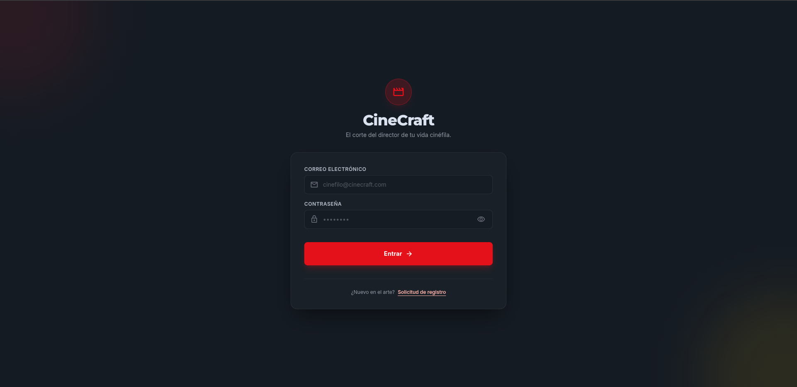

*Nota: toma la captura de la pantalla `/login`, mostrando el formulario completo con los campos "Correo Electrónico" y "Contraseña" vacíos, antes de iniciar sesión.*

---

## Pantalla 2 — Solicitud de Registro

**Ruta**: `/register-request`

Campos a llenar:
| Campo | Descripción |
|---|---|
| Nombre Completo | Tu nombre y apellido |
| Correo Electrónico | Un correo válido y único |
| Contraseña | Mínimo recomendado de seguridad |
| Confirmar Contraseña | Debe coincidir exactamente con la anterior |

Botón principal: **"Solicitar Registro"**.

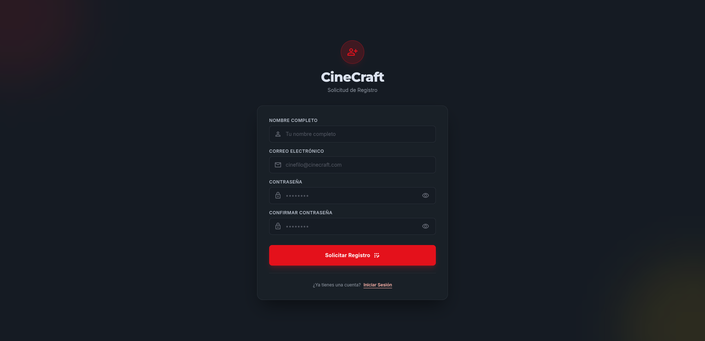

Confirmacion de Solicitud Enviada

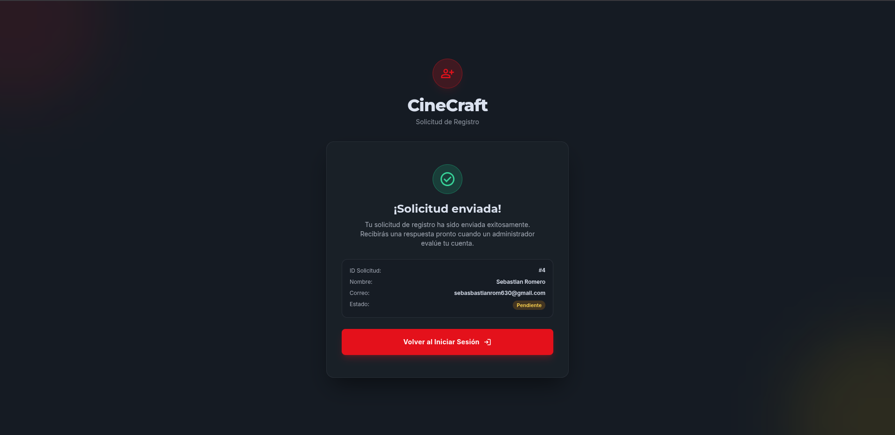

---

## Pantalla 3 — Tablero Principal (Home)

**Ruta**: `/home`

Esta pantalla no tiene campos que llenar; muestra:
- Sección de reseñas **destacadas** de la comunidad (carrusel).
- Sección **"Mis Reseñas"** con tus reseñas propias y sus acciones (editar, archivar, destacar, eliminar, compartir).
- Botón flotante **"+ Nueva Reseña"**.

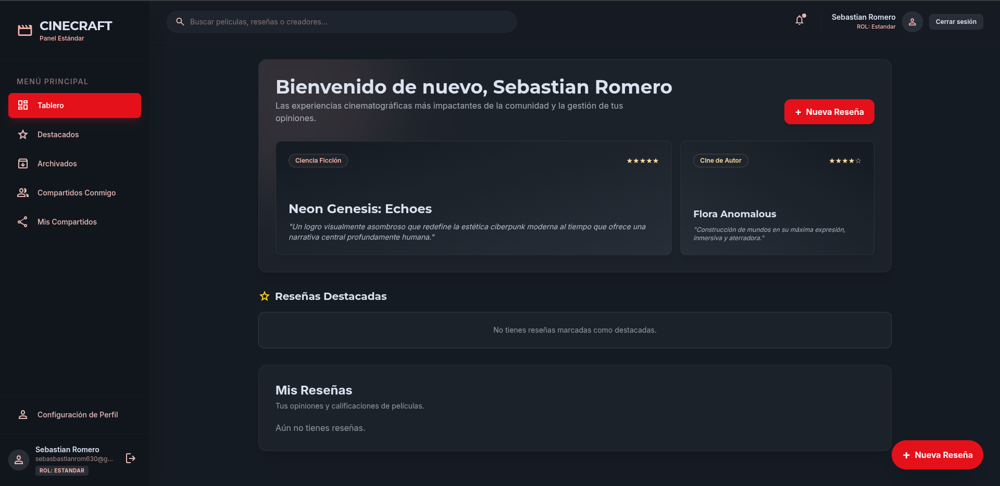

---

## Pantalla 4 — Formulario de Nueva Reseña

Se abre como ventana modal desde el botón **"+ Nueva Reseña"** en el Tablero.

Campos a llenar:
| Campo | Descripción |
|---|---|
| Película | Título de la película, ej. "The Dark Knight" |
| Calificación | Selecciona de 1 a 5 estrellas (desplegable) |
| Comentario | Tu opinión sobre la película (opcional) |
| Etiqueta | Categoría de la película, ej. "Ciencia ficción" |

Botón principal: **"Publicar reseña"**.

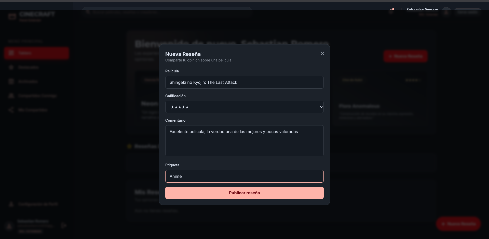
---

## Pantalla 5 — Edición de una Reseña

Se activa al hacer clic en el ícono de **editar** sobre una tarjeta de reseña existente, dentro de "Mis Reseñas".

Campos editables:
| Campo | Descripción |
|---|---|
| Título de la película | Editable directamente en la tarjeta |
| Calificación | Editable (1 a 5 estrellas) |
| Comentario | Editable |
| Etiqueta | Editable |

Botones: **"Guardar"** y **"Cancelar"**.

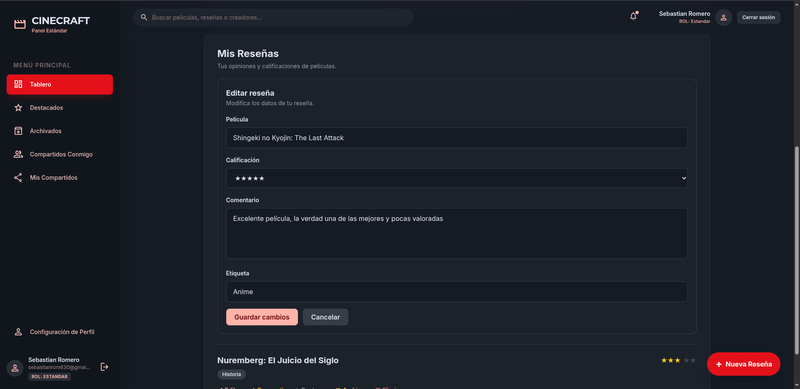
*Nota: toma la captura de una tarjeta de reseña en modo edición (después de hacer clic en el ícono de editar), mostrando los campos habilitados para modificar y los botones de guardar/cancelar.*

---

## Pantalla 6 — Confirmación de Eliminación

Aparece como ventana emergente al hacer clic en el ícono de **eliminar (🗑️)** sobre una reseña.

No tiene campos; solo botones de confirmación: **"Confirmar"** y **"Cancelar"**.

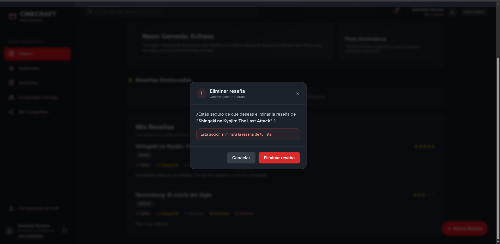
*Nota: toma la captura del cuadro de diálogo de confirmación que aparece al intentar eliminar una reseña, con el nombre de la película visible en el mensaje.*

---

## Pantalla 7 — Compartir Reseña

Se abre como ventana modal al hacer clic en el ícono de **compartir** sobre una reseña.

Campos/acciones:
| Campo | Descripción |
|---|---|
| Selecciona la reseña a compartir | Desplegable (solo aparece si no veniste desde una reseña específica) |
| Buscar por nombre o correo | Campo de texto para filtrar usuarios |
| Lista de usuarios | Marca la(s) casilla(s) de la(s) persona(s) con quien(es) compartir |

Botón principal: **"Compartir"**.

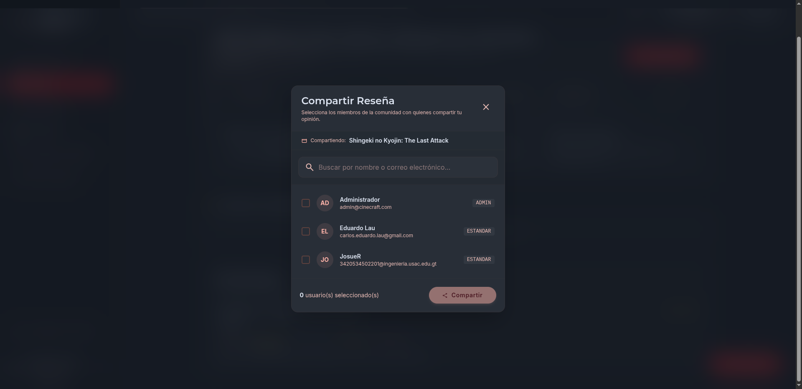

---

## Pantalla 8 — Destacados

**Ruta**: `/destacadas`

Sin campos que llenar; muestra el listado de reseñas marcadas como destacadas.

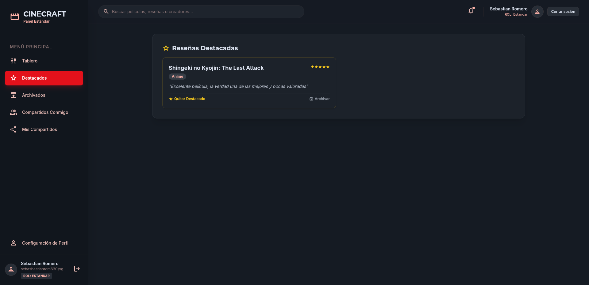

---

## Pantalla 9 — Archivados

**Ruta**: `/archivadas`

Sin campos que llenar; muestra el listado de reseñas archivadas.

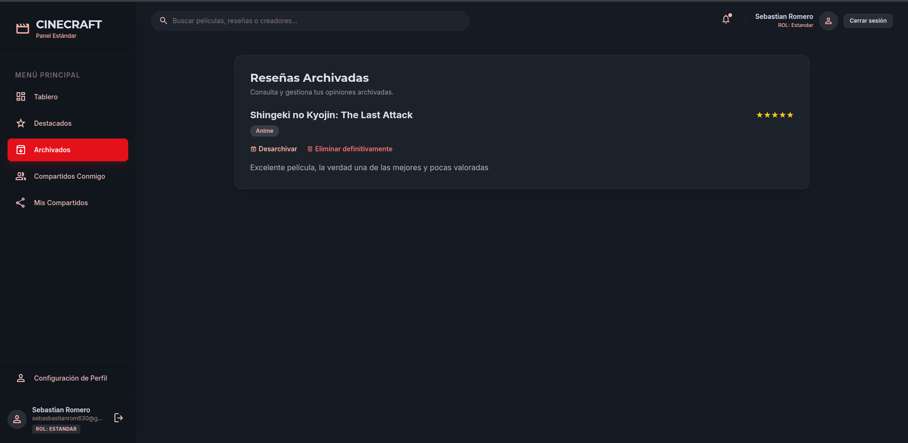

---

## Pantalla 10 — Compartidos Conmigo

**Ruta**: `/shared-with-me`

Sin campos que llenar; muestra las reseñas que otras personas compartieron contigo.

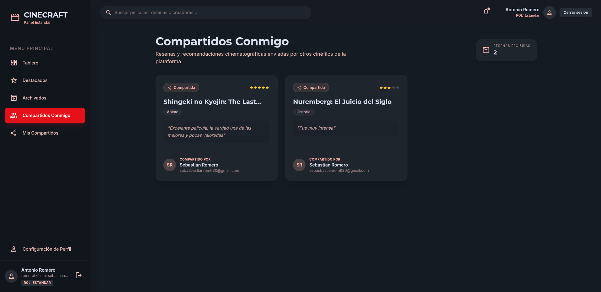

---

## Pantalla 11 — Mis Compartidos

**Ruta**: `/my-shares`

Sin campos que llenar; muestra las reseñas que tú compartiste con otros.

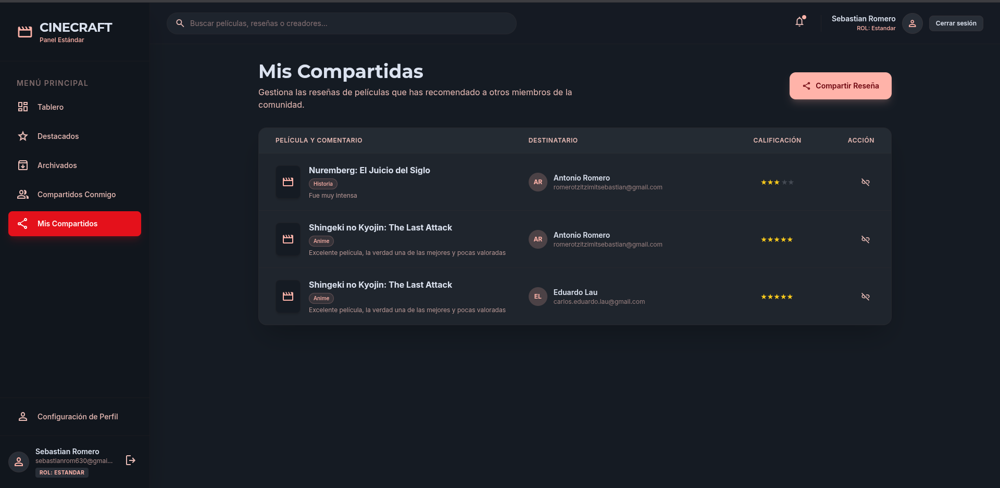

---

## Pantalla 12 — Configuración de Perfil

**Ruta**: `/profile`

Campos a llenar:
| Campo | Descripción |
|---|---|
| Nombre Completo | Tu nombre visible en la plataforma |
| Correo Electrónico | Tu correo de acceso |
| Contraseña Actual | Solo requerido si vas a cambiar tu contraseña |
| Nueva Contraseña | Mínimo 6 caracteres |
| Confirmar Contraseña | Debe coincidir con la nueva contraseña |

Botón principal: **"Guardar"**.

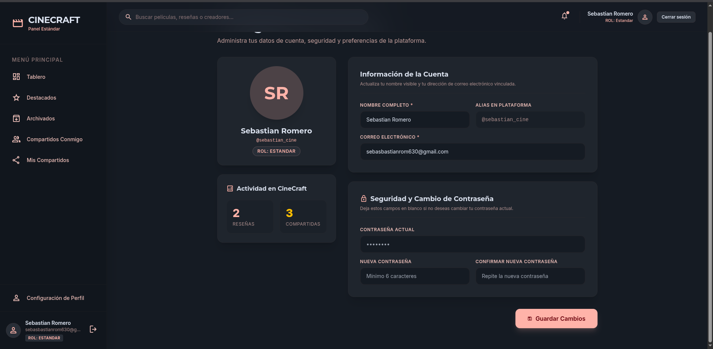
